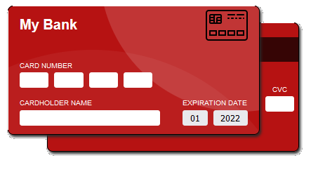

# Credit Card Input Form

This one should be self explanitory. It's a basic credit card input form that has been stylized to look like the front and back of a card.

The logo will intelligently change between Visa, Mastercard, AMEX and Discover as you type your # in.

# Screenshot

    

    

